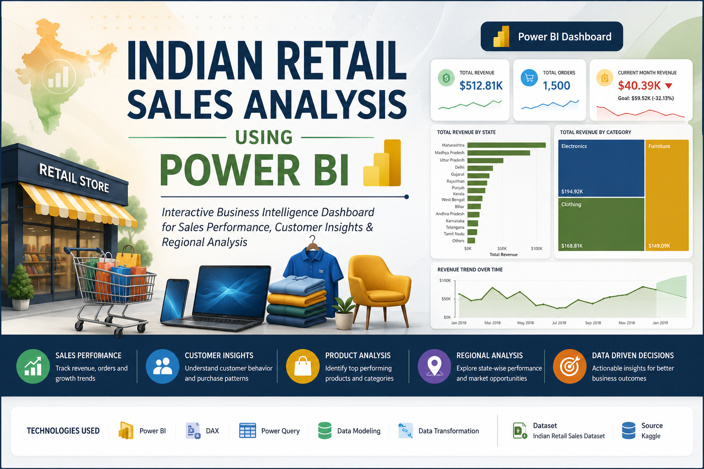

<p align="center">
  
</p>

---

# Indian Retail Sales Analysis Using Power BI

> ### Interactive Business Intelligence Dashboard for Sales Performance, Customer Insights, Product Analysis and Regional Performance


---

## 📑 Table of Contents

- [Project Overview](#-project-overview)
- [Project Highlights](#-project-highlights)
- [Business Objectives](#-business-objectives)
- [Tools & Technologies](#-tools--technologies)
- [Dataset Information](#-dataset-information)
- [Key Results](#-key-results)
- [Dashboard Pages](#-dashboard-pages)
- [Key Insights](#-key-insights)
- [Business Recommendations](#-business-recommendations)
- [Skills Demonstrated](#-skills-demonstrated)
- [Dashboard Preview](#-dashboard-preview)
- [Repository Structure](#-repository-structure)
- [Author](#-author)
- [Acknowledgements](#-acknowledgements)

---

## 📖 Project Overview

Businesses generate large volumes of sales data every day, but raw data alone does not support effective decision-making. This project demonstrates how Microsoft Power BI can be used to transform transactional retail data into meaningful business intelligence through interactive dashboards.

Using an Indian retail sales dataset obtained from Kaggle, the data was cleaned, transformed, modelled and analysed to evaluate business performance across products, customers, payment methods, regions and monthly sales trends.

The resulting dashboards provide decision-makers with actionable insights to monitor performance, identify growth opportunities and support data-driven business decisions.

---

## 🚀 Project Highlights

- 📦 1,500 Customer Orders Analysed
- 💰 $512,813 Total Revenue
- 📈 $75,004 Total Profit
- 🛍 5,615 Products Sold
- 🗺 Analysis Across Multiple Indian States
- 📊 Four Interactive Power BI Dashboards

---

## 🎯 Business Objectives

This project answers the following business questions:

- Which products generate the highest revenue?
- Which states contribute the most to sales?
- Which customers spend the most?
- Which payment methods are most preferred?
- How does revenue change throughout the year?
- Which areas require business improvement?

---

## 🛠 Tools & Technologies

- Microsoft Power BI
- Power Query
- DAX (Data Analysis Expressions)
- Data Modelling
- Interactive Dashboard Design

---

## 📂 Dataset Information

| Item | Description |
|------|-------------|
| Dataset | Online Sales Data |
| Source | Kaggle |
| Author | Samruddhi Bhosale |
| Tables | Orders.csv & Details.csv |
| Country | India |
| License | CC0-1.0 Public Domain |

---

## ⭐ Key Results

- Built an interactive Power BI dashboard using two related retail datasets.
- Analyzed **1,500 customer orders** across India.
- Evaluated **$512.81K** in total revenue and **$75.00K** in total profit.
- Designed **four interactive dashboard pages** with drill-through navigation.
- Identified top-performing states, products, categories, customers, and payment methods.
- Delivered business recommendations to improve sales performance and profitability.

## 📊 Dashboard Pages

The dashboard contains four interactive reports:

### 📈 Executive Summary

- Current Month Revenue KPIs
- Revenue Card
- Top Selling Product Card
- Order Count Card
- Total Revenue by Category Treemap
- Total Revenue by State Stacked bar chart
- Drill through embeded in Total Revenue by State to Location Dashboard

### 🛍 Product Analysis

- Product Performance Matrix Table Visualization
- Top 10 Product by Revenue Clustered column chart
- Top 10 Product by Profit Clustered column chart
- Top 10 Product by Quantity Sold Clustered column chart
- Total Revenue Card
- Total Profit Card
- Quantity Sold Card
- Orders Per Day Card
- Order Count Card

### 👥 Customer Analysis

- Top Customer Name Card
- Customer Lifetime Value Card
- Total Customer Card
- Top 10 Customer by Revenue Clustered column chart
- Top 10 Customer by Order Count Clustered column chart
- Profit Sum by Customer Name Clustered column chart
- Customer Performance Matrix Table Visualization

### 📍 Location Analysis

- Drill through on any of the selected state, take you to location dashboard and display the following;
- Current Month Revenue KPIs
- State Name Card
- State's Contribution to Total Revenue in Percentage
- State's Performance by Category and Product Matrix Table Visualization
- Payment Mode Donut Chart
- Revenue Trends showing trend line, x-axis constant line and two months forecast length
- Slicer showing start of growth slowdonw and end of growth slow down
- Bookmark and back button that take you back to executive dashboard.

---

## 📌 Key Insights

- Total Orders: **1,500**
- Quantity Sold: **5,615**
- Total Revenue: **$512,813**
- Total Profit: **$75,004**
- Maharashtra generated the highest revenue.
- Madhya Pradesh recorded the highest number of orders.
- Electronics generated the highest revenue among all categories.
- Printers generated the highest revenue among sub-categories.
- Saree was the most sold product.
- Cash on Delivery accounted for approximately **35.7%** of all payments.
- Harivansh was the highest spending customer.
- January recorded the highest monthly revenue, while July recorded the lowest.

---

## 💡 Business Recommendations

- Increase investment in high-performing states.
- Improve marketing efforts in low-performing states.
- Continue promoting Electronics due to its strong revenue contribution.
- Develop loyalty programmes for high-value customers.
- Improve inventory planning using monthly sales trends.
- Encourage greater adoption of digital payment methods.

---

## 💼 Skills Demonstrated

✔ Data Cleaning

✔ Power Query

✔ Data Modelling

✔ DAX

✔ Dashboard Development

✔ KPI Design

✔ Business Intelligence

✔ Data Storytelling

✔ Data Visualization

---

## 🖼 Dashboard Preview

### 📊 Executive Dashboard


---

### 🛍 Product Dashboard


---

### 👥 Customer Dashboard


---

### 📍 Location Dashboard


---

## 📁 Repository Structure

```text
indian-retail-sales-analysis
│
├── README.md
├── Indian Retail Sales Dashboard.pbix
├── Orders.csv
├── Details.csv
└── images/
```

## 👨‍💻 Author

**Quadri Akanbi Olahassan**

Petroleum Engineer | Data Analytics & Statistics Enthusiast | Machine Learning Enthusiast

---

## 🙏 Acknowledgements

Dataset obtained from the **Online Sales Data** dataset published on Kaggle by **Samruddhi Bhosale**.

This project was developed for educational and portfolio purposes.
